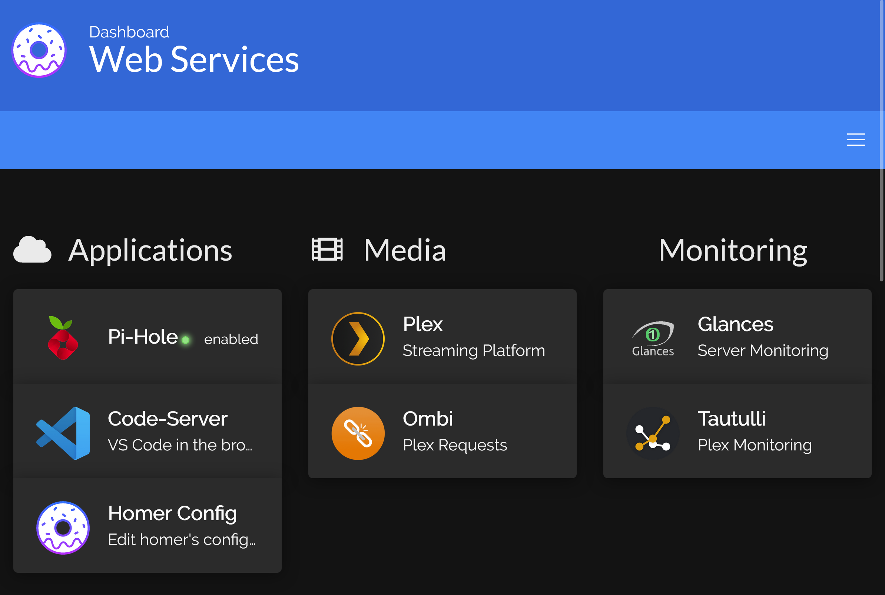
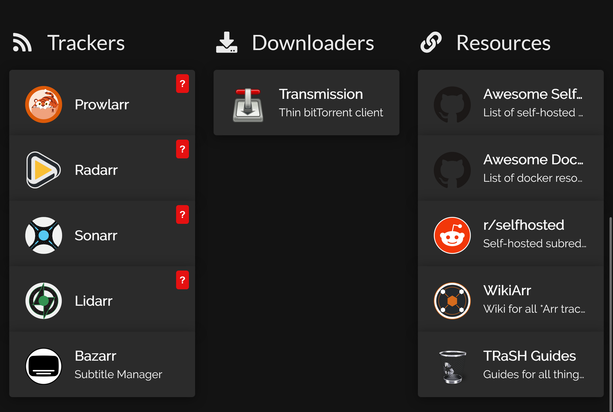



<details>
    <summary>{{ title }}</summary>
{{ caller() }}
</details>



# Home Media Server

This repo contains tools to setup a home media server remotely via [docker-compose](https://docs.docker.com/compose/) and [fabric](https://www.fabfile.org/). It is meant to be a good starting point, not a comprehensive solution. 

The services currently supported are: 

- [{{service_name | title}}]({{ services[service_name].link }}): {{ services[service_name].description }}



Docker-compose is used to manage containerized services and fabric is used to deploy/update and configure the remote host by running commands through SSH.

> :warning: This project was only tested on a raspberry pi 3B running headless raspi-os, but should work on other debian/ubuntu distros.

## Requirements

On local machine you'll need python (>= 3.6) and the following packages: 

```
pip install -r requirements.txt
```

The remote is assumed to be a linux machine which can be accessed via SSH. 

## TL;DR

> :warning: Only run these scripts if you trust the numerous sources they use. While most code is ran in docker (so is relatively sandboxed) and comes from well-established, trusted sources (such as [linuxserver](https://www.linuxserver.io/)), some things are installed by piping to bash (notably docker itself). You should always analyse the source for yourself!

To deploy the default services to your host just run (locally):
```
fab deploy -H <user>@<addr> --prompt-for-login-password
```

Then you should be able to simply launch the services by running (on the remote host):
```
dcp up -d
```

The above will pull in the newest images, and run all services in containers. After a few minutes (once everything is initialized), you should be able to see the homer dashboard by visiting `http://<remote-ip>`. Which should look like the following:

<p align="center">
  
  
</p>

There are a few other tasks that help you configure services (all `config-*` tasks below), but most services will require some further configuration through their webUI. 

Some useful monitoring tools can also be installed via the tasks `install-ctop/lzd`.

And of course, *everything* is customizable!

## Project Structure

### Running Tasks

The main setup script lives inside [`fabfile.py`](fabfile.py). You can view all available tasks like so:

```
> fab --list
{{ fabric.tasks }}
```

To run an above task on your remote machine you can run:

```
fab <task> [task-args] -H <user>@<addr> --prompt-for-login-password
```

Local commands, such as `render-readme`, need not the `-H` option or any other host related options.

You can also setup a `fabric.yml` config file to hold host information such as user, address and password. See [here](https://docs.fabfile.org/en/latest/concepts/configuration.html) for more information on fabric's config options.

### Service Configuration

The main configuration file is `services.yml`. Inside you'll find a list of services and associated data. If a service enabled, then it will be included in the docker-compose file. This file is templated via [jinja](https://palletsprojects.com/p/jinja/).

*Note:* A service that is marked as `true` is enabled (i.e: `service: true` is equivalent to `service: enabled: true`).

<details>
    <summary>Contents of <code>services.yml</code></summary>

```yaml
{{ services_raw }}
```

</details>

### Secret Management

To not have passwords written in plain text in any config files we use [keyring](https://keyring.readthedocs.io/en/latest/). 

On the command line you need to run:
```
> keyring set system username
```

To set any passwords/secrets you might need. You can then retreive them by using the following syntax in a template: `{{ keyring_get("system", "username") }}`.

### Docker-compose file

All services run through docker compose. The compose file itself it jinja-templated and uses YAML anchors to reduce config duplication.

Individual services can be enabled/disabled in `services.yml`.

### Profile (bash aliases)

The `.profile` file contains a few useful bash aliases. Feel free to modify.

### Working Directories

By default, all services are configured to be in `/srv/<service name>`, and the media is located at `/mnt/mybook/srv/media/`. These defaults can be edited in `fabfile.py`. 

## Mounting an external disk

See [here](https://pimylifeup.com/raspberry-pi-mount-usb-drive/) for a more in-depth tutorial. The TL;DR is below:
```
# Find disk, get info, make mount dir
df -h
sudo blkid /dev/sda1
sudo apt install ntfs-3g
sudo mkdir -p /mnt/mybook
```

Then in `/etc/fstab` add the following line:
```
UUID=[UUID] /mnt/mybook [TYPE] defaults,auto,users,rw,nofail,noatime 0 0
```

## Default docker-compose settings per service

Here we show the snippet of the docker compose file that is responsible for each service. 


{% call details('Compose for %s' % (service_name | title)) %}
```yaml
{{ services[service_name].compose }}
```


  

## Troubleshooting & FAQ


This is likely due to the PI running out of RAM (i.e: it can't allocate pages for new processes). This can be "fixed" by resizing the swap partition. Try rebooting and running the `resize-swap` task with a larger size (maybe 2048 MB).



In `/boot/config.txt` add the following two lines and reboot:
```
dtoverlay=disable-wifi
dtoverlay=disable-bt
```



You'll need to create an entry in `services.yml` with all the associated fields and add an entry in the docker file and optionally in homer's config. Make sure to wrap these in a jinja if enabled conditional to be able to easily enable/disable the service. 


## Changelog

Most recent on top:

- Change volumes for *arr stack to enable hardlinks. Removed all references to individual media folders, i.e:`{{ MEDIA_REMOTE_ROOT }}/tv:/tv` for tv, movies, music, and downloads and replaced them with one volume:`{{ MEDIA_REMOTE_ROOT }}:/media`.