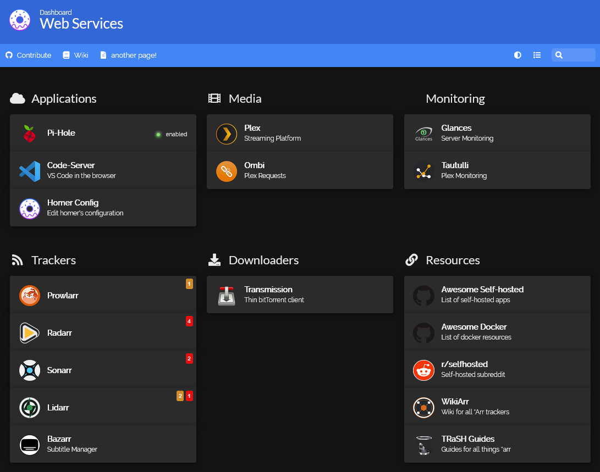

# Home Media Server

This repo contains tools to setup a home media server remotely via [docker-compose](https://docs.docker.com/compose/) and [fabric](https://www.fabfile.org/). It is meant to be a good starting point, not a comprehensive solution. 

The services currently supported are:
- [Homer](https://github.com/bastienwirtz/homer): A very simple static homepage for your server.
- [Pihole](https://github.com/pi-hole/pi-hole): A black hole for Internet advertisements
- [Code_server](https://github.com/coder/code-server): VS Code in the browser
- [Plex](https://www.plex.tv/): Plex organizes all of your personal media so you can enjoy it no matter where you are.
- [Ombi](https://github.com/Ombi-app/Ombi): Want a Movie or TV Show on Plex/Emby/Jellyfin? Use Ombi!
- [Prowlarr](https://github.com/Prowlarr/Prowlarr): Indexer manager/proxy built on the popular *arr stack
- [Radarr](https://github.com/Radarr/Radarr): A fork of Sonarr to work with movies  la Couchpotato.
- [Sonarr](https://github.com/Sonarr/Sonarr): Smart PVR for newsgroup and bittorrent users.
- [Lidarr](https://github.com/Lidarr/Lidarr): Looks and smells like Sonarr but made for music.
- [Bazarr](https://github.com/morpheus65535/bazarr): Bazarr is a companion application to Sonarr and Radarr. It manages and downloads subtitles based on your requirements. You define your preferences by TV show or movie and Bazarr takes care of everything for you.
- [Wireguard](https://github.com/linuxserver/docker-wireguard): An extremely simple yet fast and modern VPN that utilizes state-of-the-art cryptography.
- [Gluetun](https://github.com/qdm12/gluetun): VPN client in a thin Docker container for multiple VPN providers, written in Go, and using OpenVPN or Wireguard, DNS over TLS, with a few proxy servers built-in.
- [Transmission](https://github.com/transmission/transmission): A fast, easy, and free BitTorrent client.
- [Watchtower](https://github.com/containrrr/watchtower): A process for automating Docker container base image updates.
- [Glances](https://github.com/nicolargo/glances): Glances an Eye on your system. A top/htop alternative for GNU/Linux, BSD, Mac OS and Windows operating systems.
- [Tautulli](https://github.com/Tautulli/Tautulli): A Python based monitoring and tracking tool for Plex Media Server.


Docker-compose is used to manage containerized services and fabric is used to deploy/update and configure the remote host by running commands through SSH.

> :warning: This project was only tested on a raspberry pi 3B running headless raspi-os, but should work on other debian/ubuntu distros.

## Requirements

On local machine you'll need python (>= 3.6) and the following packages: 

```
pip install -r requirements.txt
```

The remote is assumed to be a linux machine which can be accessed via SSH. 

## TL;DR

> :warning: Only run these scripts if you trust the numerous sources they use. While most code is ran in docker (so is relatively sandboxed) and comes from well-established, trusted sources (such as [linuxserver](https://www.linuxserver.io/)), some things are installed by piping to bash (notably docker itself). You should always analyse the source for yourself!

To deploy the default services to your host just run (locally):
```
fab deploy -H <user>@<addr> --prompt-for-login-password
```

Then you should be able to simply launch the services by running (on the remote host):
```
dcp up -d
```

The above will pull in the newest images, and run all services in containers. After a few minutes (once everything is initialized), you should be able to see the homer dashboard by visiting `http://<remote-ip>`. Which should look like the following:

<p align="center"> 
  
</p>

There are a few other tasks that help you configure services (all `config-*` tasks below), but most services will require some further configuration through their webUI. 

Some useful monitoring tools can also be installed via the tasks `install-ctop/lzd`.

And of course, *everything* is customizable!

## Project Structure

### Running Tasks

The main setup script lives inside [`fabfile.py`](fabfile.py). You can view all available tasks like so:

```
> fab --list
Available tasks:

  apt-update                                          (apt) Update and upgrade system
  configure-homer (config-homer)                      Fetch and add apikey to homer dashboard for *arr apps
  configure-plex (config-plex)                        Claim plex server, see: `https://www.plex.tv/claim/`
  configure-transmission (config-transmission)        Upload transmission's `settings.json` to host
  configure-wireguard (config-wg, config-wireguard)   Upload wireguard config (i.e: wg0.conf) to host
  dcp-running-services (dcp-ls-up)                    List running services on remote host
  dcp-services (dcp-ls)                               List services in remote's compose file
  deploy                                              Install services with docker-compose
  get-arrkey                                          Retrieve API key for a *arr service
  install-ctop                                        Install top-like interface for container metrics
  install-docker                                      Install docker if not present
  install-docker-compose                              Install docker-compose if not present
  install-lazydocker (install-lzd)                    Install the lazy docker manager
  install-py3                                         Install python3 (and pip!) if not present
  reboot                                              Reboot host machine
  render-readme                                       Update code segments in the README file (runs on local)
  set-swap-size (resize-swap)                         Set swap partition size on remote (in MB)
  verify-vpn                                          Test that the VPN is connected and it's IP isn't local


```

To run an above task on your remote machine you can run:

```
fab <task> [task-args] -H <user>@<addr> --prompt-for-login-password
```

Local commands, such as `render-readme`, need not the `-H` option or any other host related options.

You can also setup a `fabric.yml` config file to hold host information such as user, address and password. See [here](https://docs.fabfile.org/en/latest/concepts/configuration.html) for more information on fabric's config options.

### Service Configuration

The main configuration file is `services.yml`. Inside you'll find a list of services and associated data. If a service enabled, then it will be included in the docker-compose file. This file is templated via [jinja](https://palletsprojects.com/p/jinja/).

*Note:* A service that is marked as `true` is enabled (i.e: `service: true` is equivalent to `service: enabled: true`).

<details>
    <summary>Contents of <code>services.yml</code></summary>

```yaml
# HOMEPAGE
homer:
  enable: true
  github: https://github.com/bastienwirtz/homer

# QoL SERVICES
pihole:
  enable: true
  webpassword: {{ keyring_get("webserver", "pihole") }}
  github: https://github.com/pi-hole/pi-hole
code-server:
  enable: true
  github: https://github.com/coder/code-server

# MEDIA SERVERS
plex:
  enable: true
  short_description: "Plex organizes all of your personal media so you can enjoy it no matter where you are."
  link: https://www.plex.tv/
  claim: ""
ombi:
  enable: true
  github: https://github.com/Ombi-app/Ombi

# TRACKERS
prowlarr:
  enable: true
  github: https://github.com/Prowlarr/Prowlarr
  short_description: "Indexer manager/proxy built on the popular *arr stack"
  apikey: ""
radarr:
  enable: true
  github: https://github.com/Radarr/Radarr
  apikey: ""
sonarr:
  enable: true
  github: https://github.com/Sonarr/Sonarr
  apikey: ""
lidarr:
  enable: true
  github: https://github.com/Lidarr/Lidarr
  apikey: ""
bazarr:
  enable: true
  github: https://github.com/morpheus65535/bazarr
  apikey: ""

# DOWNLOADERS & VPNs
wireguard:
  enable: false
  github: https://github.com/linuxserver/docker-wireguard
  short_description: "An extremely simple yet fast and modern VPN that utilizes state-of-the-art cryptography."
gluetun:
  enable: true
  regions: "Netherlands"
  provider: {{ keyring_get("webserver", "vpn-provider") }}
  user: {{ keyring_get("webserver", "vpn-usr") }}
  password: {{ keyring_get("webserver", "vpn-pass") }}
  github: https://github.com/qdm12/gluetun
transmission:
  enable: true
  user: {{ keyring_get("webserver", "transmission-usr") }}
  password: {{ keyring_get("webserver", "transmission-pass") }}
  github: https://github.com/transmission/transmission
  short_description: "A fast, easy, and free BitTorrent client."

# MAINTENANCE & MONITORING
watchtower:
  enable: false
  github: https://github.com/containrrr/watchtower
glances:
  enable: true
  github: https://github.com/nicolargo/glances
tautulli:
  enable: true
  github: https://github.com/Tautulli/Tautulli

```

</details>

### Secret Management

To not have passwords written in plain text in any config files we use [keyring](https://keyring.readthedocs.io/en/latest/). 

On the command line you need to run:
```
> keyring set system username
```

To set any passwords/secrets you might need. You can then retreive them by using the following syntax in a template: `{{ keyring_get("system", "username") }}`.

### Docker-compose file

All services run through docker compose. The compose file itself it jinja-templated and uses YAML anchors to reduce config duplication.

Individual services can be enabled/disabled in `services.yml`.

### Profile (bash aliases)

The `.profile` file contains a few useful bash aliases. Feel free to modify.

### Working Directories

By default, all services are configured to be in `/srv/<service name>`, and the media is located at `/mnt/mybook/srv/media/`. These defaults can be edited in `fabfile.py`. 

## Mounting an external disk

See [here](https://pimylifeup.com/raspberry-pi-mount-usb-drive/) for a more in-depth tutorial. The TL;DR is below:
```
# Find disk, get info, make mount dir
df -h
sudo blkid /dev/sda1
sudo apt install ntfs-3g
sudo mkdir -p /mnt/mybook
```

Then in `/etc/fstab` add the following line:
```
UUID=[UUID] /mnt/mybook [TYPE] defaults,auto,users,rw,nofail,noatime 0 0
```

## Default docker-compose settings per service

Here we show the snippet of the docker compose file that is responsible for each service.
<details>
    <summary>Compose for Homer</summary>

```yaml
homer:
  image: b4bz/homer
  container_name: homer
  volumes:
    - {{ SERVICES_REMOTE_ROOT }}/homer:/www/assets
    - {{ SERVICES_REMOTE_ROOT }}/dashboard-icons:/www/assets/dashboard-icons
  ports:
    - 80:8080
  environment:
    - user=$DOCKER_USER
    - TZ=America/Chicago
  restart: unless-stopped
```

</details>
<details>
    <summary>Compose for Pihole</summary>

```yaml
pihole:
  container_name: pihole
  image: pihole/pihole:latest
  hostname: piholevm
  ports:
    - "53:53/tcp"
    - "53:53/udp"
    - "8081:80/tcp"
  environment:
    - user=$DOCKER_USER
    - TZ=America/Chicago
    - WEBPASSWORD={{ pihole.webpassword }}
  volumes:
    - {{ SERVICES_REMOTE_ROOT }}/pihole/etc/pihole:/etc/pihole
    - {{ SERVICES_REMOTE_ROOT }}/pihole/etc/dnsmasq.d:/etc/dnsmasq.d
  cap_add:
    - NET_ADMIN
  restart: unless-stopped
```

</details>
<details>
    <summary>Compose for Code_server</summary>

```yaml
code-server:
  image: lscr.io/linuxserver/code-server
  container_name: code-server
  environment:
    - user=$DOCKER_USER
    - TZ=America/Chicago
    - DEFAULT_WORKSPACE=/home
  volumes:
    - {{ SERVICES_REMOTE_ROOT }}/vscode:/config
    - ~/workspace:/home
    - {{ SERVICES_REMOTE_ROOT }}/homer/:/home/homer
  ports:
    - 8443:8443
  restart: unless-stopped
```

</details>
<details>
    <summary>Compose for Plex</summary>

```yaml
plex:
  image: lscr.io/linuxserver/plex
  container_name: plex
  network_mode: host
  #ports:
  #  - 32400:32400
  environment:
    - PUID=$PUID
    - PGID=$PGID
    - TZ=America/Chicago
    - VERSION=docker
    
    - PLEX_CLAIM={{ plex.claim }}
    
```

</details>
<details>
    <summary>Compose for Ombi</summary>

```yaml
ombi:
  image: lscr.io/linuxserver/ombi
  container_name: ombi
  environment:
    - user=$DOCKER_USER
    - TZ=America/Chicago
  volumes:
    - {{ SERVICES_REMOTE_ROOT }}/ombi:/config
  ports:
    - 3579:3579
  restart: unless-stopped
```

</details>
<details>
    <summary>Compose for Prowlarr</summary>

```yaml
prowlarr:
  # Note: use dev branch as there is no master branch atm
  image: lscr.io/linuxserver/prowlarr:develop
  container_name: prowlarr
  environment:
    - user=$DOCKER_USER
    - TZ=America/Chicago
  volumes:
    - {{ SERVICES_REMOTE_ROOT }}/prowlarr:/config
  <<: *usevpn
  restart: unless-stopped
```

</details>
<details>
    <summary>Compose for Radarr</summary>

```yaml
radarr:
  image: lscr.io/linuxserver/radarr
  container_name: radarr
  environment:
    - user=$DOCKER_USER
    - TZ=America/Chicago
  volumes:
    - {{ SERVICES_REMOTE_ROOT }}/radarr:/config
    - {{ MEDIA_REMOTE_ROOT }}:/media
  <<: *usevpn
  restart: unless-stopped
```

</details>
<details>
    <summary>Compose for Sonarr</summary>

```yaml
sonarr:
  image: lscr.io/linuxserver/sonarr
  container_name: sonarr
  environment:
    - user=$DOCKER_USER
    - TZ=America/Chicago
  volumes:
    - {{ SERVICES_REMOTE_ROOT }}/sonarr:/config
    - {{ MEDIA_REMOTE_ROOT }}:/media
  <<: *usevpn
  restart: unless-stopped
```

</details>
<details>
    <summary>Compose for Lidarr</summary>

```yaml
lidarr:
  image: lscr.io/linuxserver/lidarr
  container_name: lidarr
  environment:
    - user=$DOCKER_USER
    - TZ=America/Chicago
  volumes:
    - {{ SERVICES_REMOTE_ROOT }}/lidarr:/config
    - {{ MEDIA_REMOTE_ROOT }}:/media
  <<: *usevpn
  restart: unless-stopped
```

</details>
<details>
    <summary>Compose for Bazarr</summary>

```yaml
bazarr:
  image: lscr.io/linuxserver/bazarr
  container_name: bazarr
  environment:
    - user=$DOCKER_USER
    - TZ=America/Chicago
  volumes:
    - {{ SERVICES_REMOTE_ROOT }}/bazarr:/config
    - {{ MEDIA_REMOTE_ROOT }}:/media
  <<: *usevpn
  restart: unless-stopped
```

</details>
<details>
    <summary>Compose for Wireguard</summary>

```yaml
network_mode: "service:wireguard"
depends_on: [ "wireguard", ]

network_mode: "service:gluetun"
depends_on: [ "gluetun", ]
```

</details>
<details>
    <summary>Compose for Gluetun</summary>

```yaml
gluetun:
  image: qmcgaw/gluetun
  cap_add:
    - NET_ADMIN
  volumes:
    - {{ SERVICES_REMOTE_ROOT }}/gluetun:/gluetun
  environment:
    - VPN_SERVICE_PROVIDER={{ gluetun.provider }}
    - OPENVPN_USER={{ gluetun.user }}
    - OPENVPN_PASSWORD={{ gluetun.password }}
    - SERVER_REGIONS={{ gluetun.regions }}
  <<: *vpnports
  restart: unless-stopped
```

</details>
<details>
    <summary>Compose for Transmission</summary>

```yaml
transmission:
  image: ghcr.io/linuxserver/transmission
  container_name: transmission
  environment:
    - user=$DOCKER_USER
    - TZ=America/Chicago
    - TRANSMISSION_WEB_HOME=/combustion-release/
    - USER={{ transmission.user }}
    - PASS={{ transmission.password }}
  volumes:
    - {{ SERVICES_REMOTE_ROOT }}/transmission:/config
    - {{ MEDIA_REMOTE_ROOT }}/downloads:/media/downloads
  <<: *usevpn
  restart: unless-stopped
```

</details>
<details>
    <summary>Compose for Watchtower</summary>

```yaml
watchtower:
  image: containrrr/watchtower
  volumes:
    - /var/run/docker.sock:/var/run/docker.sock
```

</details>
<details>
    <summary>Compose for Glances</summary>

```yaml
glances:
  image: nicolargo/glances:latest
  container_name: glances
  volumes:
    - /var/run/docker.sock:/var/run/docker.sock:ro
  environment:
    - user=$DOCKER_USER
    - TZ=America/Chicago
    - GLANCES_OPT=-w
  ports:
    - 61208:61208
    - 61209:61209
  restart: unless-stopped
```

</details>
<details>
    <summary>Compose for Tautulli</summary>

```yaml
tautulli:
  image: ghcr.io/tautulli/tautulli
  container_name: tautulli
  volumes:
    - {{ SERVICES_REMOTE_ROOT }}/tautulli:/config
  environment:
    - user=$DOCKER_USER
    - TZ=America/Chicago
  ports:
    - 8181:8181
  restart: unless-stopped
```

</details>
  

## Troubleshooting & FAQ

<details>
    <summary><i>Raspberry pi can be pinged but does not respond to ssh/http requests.</i></summary>

This is likely due to the PI running out of RAM (i.e: it can't allocate pages for new processes). This can be "fixed" by resizing the swap partition. Try rebooting and running the `resize-swap` task with a larger size (maybe 2048 MB).

</details>

<details>
    <summary><i>If not needed wifi/bluetooth can be disabled on the PI to save power. This might be required if you have a limited power supply.</i></summary>

In `/boot/config.txt` add the following two lines and reboot:
```
dtoverlay=disable-wifi
dtoverlay=disable-bt
```

</details>

<details>
    <summary><i>How to add a new service?</i></summary>

You'll need to create an entry in `services.yml` with all the associated fields and add an entry in the docker file and optionally in homer's config. Make sure to wrap these in a jinja if enabled conditional to be able to easily enable/disable the service. 

</details>

<details>
    <summary><i>I can't see a service's memory consumption!</i></summary>

If `lazy-docker` or `docker stats --no-stream` doesn't show memory consumption, you'll probably need to enable the cgroup memory manager by adding `cgroup_enable=cpuset cgroup_enable=memory cgroup_memory=1` to your `/boot/cmdline.txt` file. See [here](https://github.com/docker/for-linux/issues/1112) for more info.

</details>

## Changelog

Most recent on top:

- Add transmission configuration task and associated files. Now all *arrs can see the directory transmission downloads to as it's in `/media/downloads`.

- Change volumes for *arr stack to enable hardlinks. Removed all references to individual media folders, i.e:`{{ MEDIA_REMOTE_ROOT }}/tv:/tv` for tv, movies, music, and downloads and replaced them with one volume:`{{ MEDIA_REMOTE_ROOT }}:/media`.