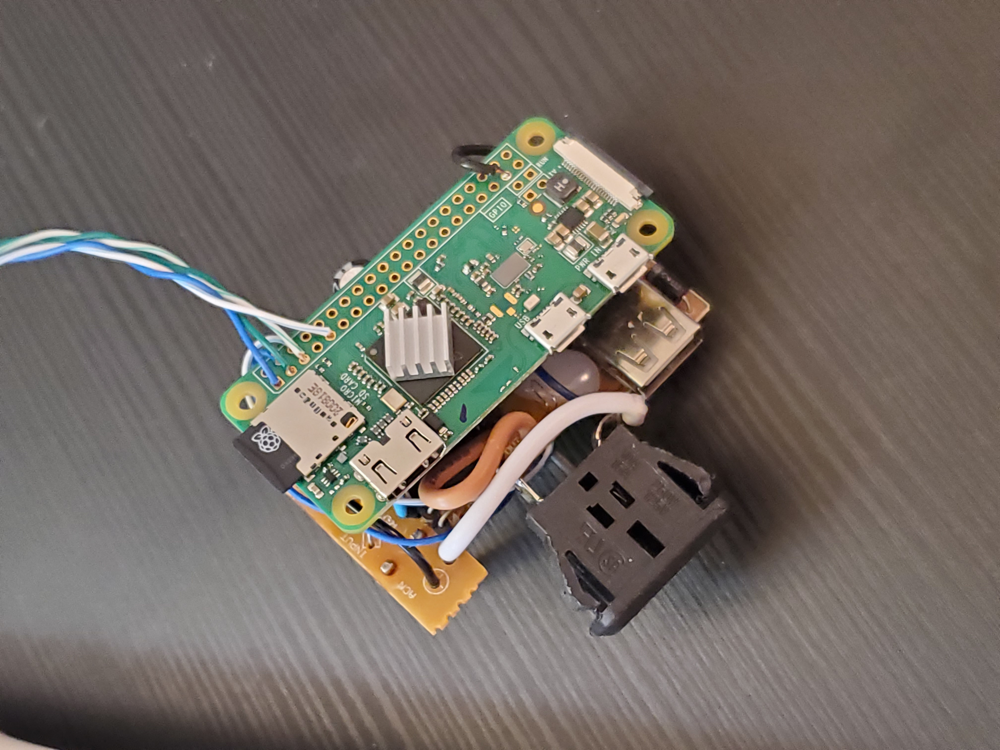
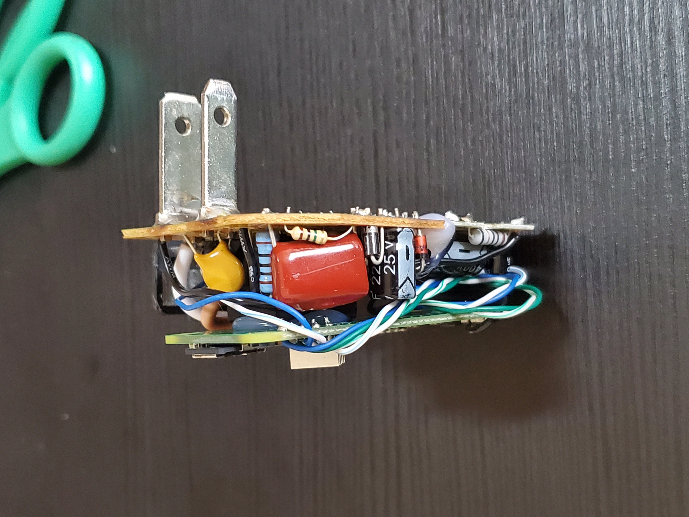

# RPI Zero based smart plug and sensor

Using an old digital Christmas light timer (westinghouse 28441 timer), a cheap 5v power supply, a raspberry pi zero w and a sensor (BME680) we can make a smart plug that also tracks temperature/humidity/pressure/air quality!

| | | | |
|:-------------------------:|:-------------------------:|:-------------------------:|:-------------------------:|
|||||
|||||
|||||

## Hardware

The first thing to do is to understand how the timer activates it's relay. In my case, there were three wires between the relay module and the internal timer which corresponded to GND, VCC (~2.3v) and Signal. When the signal wire was shorted to VCC the relay activated! 

I soldered this Signal wire to the pi and also tied the pi's ground to the GND wire from the relay circuit. I'm using GPIO number 26 which (for the rpi zero w) is physical pin #37.

You can test the switch is working by setting the pin as an output and manually toggling it low or high:
```
raspi-gpio set <pin id> op
raspi-gpio set <pin id> dl
raspi-gpio set <pin id> dh 
```

Then you can attach your sensor to the pi. Mine was I2C based so I had to use the GPIO pins 2 and 3 (physical pins 3 and 5) as the SDA and SCL signals. Make sure to also plug in power and that the I2C bus is enabled. On raspbian you can enable it via `sudo raspi-config`.

If using the BME680 as well, you can start by taking a look at [this tutorial](https://learn.pimoroni.com/article/getting-started-with-bme680-breakout) and check that everything is working as expected.

Finally, to make it all fit into one package I embedded a 5v power supply. Some timer circuits might already have one built in but mine did not.


## Software

### Step 1: Get MQTT broker working on server

You'll need to install a MQTT broker to run alongside home assistant (HA). 

If you have HA supervisor, [there's and add-on you need to install](https://www.home-assistant.io/docs/mqtt/broker/).

Otherwise, you'll need to run mosquitto in it's own docker container. Here's a sample docker-compose config:
```
services:
  mosquitto:
    container_name: mosquitto
    image: eclipse-mosquitto
    network_mode: host
    volumes:
      - ~/mosquitto/mosquitto.conf:/mosquitto/config/mosquitto.conf
```

The conf file should at the very least contain the following lines to enable outside (non localhost) connections:

```
listener 1883
allow_anonymous true
```

Then, in HA's webUI, go to `/config/integrations` then `add integration`. Search for `mqtt` and add it. You'll need to point it to the broker which should be at `localhost` port `1883`. Once added, you can click re-configure and update the defaults.

### Step 2: Add integration into home assistant

In HA's `configuration.yaml` file (likely located in `/srv/homeassistant`, otherwise see [here](https://www.home-assistant.io/docs/configuration/)) you'll need to add the following:

```
mqtt:
  switch:
  - name: "Bedroom Smartplug"
    unique_id: "bedroom.smartplug1"
    icon: "mdi:lightbulb"
    state_topic: "home/bedroom/smartplug1/get"
    command_topic: "home/bedroom/smartplug1/set"
    qos: 1
    payload_on: "on" 
    payload_off: "off" 
    retain: false
  sensor:
  - name: "Bedroom Temperature"
    unique_id: "bedroom.temperature1"
    icon: "mdi:thermometer"
    state_topic: "home/bedroom/smartsensor1"
    unit_of_measurement: "°C"
    value_template: "{{ value_json.temperature }}"
  - name: "Bedroon Humidity"
    unique_id: "bedroom.humidity1"
    icon: "mdi:water"
    state_topic: "home/bedroom/smartsensor1"
    unit_of_measurement: "%"
    value_template: "{{ value_json.humidity }}"
  - name: "Bedroon Pressure"
    unique_id: "bedroom.pressure1"
    icon: "mdi:airballoon"
    state_topic: "home/bedroom/smartsensor1"
    unit_of_measurement: "hPa"
    value_template: "{{ value_json.pressure }}"
```
Save it and restart HA or reload the yaml config in the settings page under server control (if you can't find this you'll need to enable advanced mode in settings).

### Step 3: Configure Raspberry Pi

If you haven't yet, you'll need to flash your pi using the raspi imager and enable SSH. Make sure to also set up wifi through the imager as the pi will run headless.

A sample code for the smart plug in located in `smartplug.py`. This only deals with the plug, not the sensor. The sensor code is in `smartsensor.py`. These are seperated because the sensor code only needs to run periodically while the plug code needs to constantly listen for commands. 

#### Smart Plug

Once the smart plug code tweaked and uploaded, you can make it into a systemd service which will make it autostart on boot.

Create a new file `/lib/systemd/system/smartplug.service` and in it add:

```
[Unit]
Description=Smart Plug
After=multi-user.target

[Service]
WorkingDirectory=/home/pi/
User=pi
Restart=always
ExecStart=/usr/bin/python3 /home/pi/smartplug.py

[Install]
WantedBy=multi-user.target
```

Then change its permissions, and add it as a service like so:

```
sudo chmod 644 /lib/systemd/system/smartplug.service

sudo systemctl daemon-reload
sudo systemctl enable smartplug.service
sudo systemctl start smartplug.service
```

If it's not working you can debug by running `sudo systemctl status smartplug.service`.


#### Smart Sensor

Once installed, you'll want to burn in the sensor so it can adjust to operating conditions. You can do this by running `bme680-readall.py` for at least 20 minutes.

Then, tweak and upload the `smartsensor.py` file and run it periodically via a cron job by running `crontab -e` and adding the following line ([to run in every 5 minutes](https://crontab.guru/every-5-minutes)):

```
*/5  * * * * python3 ~/smartsensor.py
```

#### Extras

You can also run other things on the pi. I've set mine up to run a secondary (redundant) pihole instance for my home network. 

## Resources

[BME680 Tutorial](https://learn.pimoroni.com/article/getting-started-with-bme680-breakout), [Raspi Pinout](https://pinout.xyz/#), [Custom MQTT sensor example](https://selfhostedhome.com/creating-a-diy-home-assistant-switch-using-micropython/), [HA switch config](https://roelofjanelsinga.com/articles/how-to-create-switch-dashboard-home-assistant/), [Systemd tutorial](https://tecadmin.net/run-shell-script-as-systemd-service/), [HA Custom sensor](https://sandervankasteel.nl/hardware/home%20assistant/philips%20hue/2019/07/13/homeassistant-mqtt-am2302.html)
